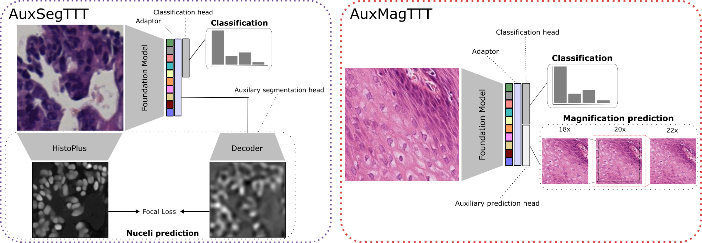

<div id="readme-top"></div>

<div align="center">
<h1 align="center">Investigating Test-Time Training for Patch Classification in Pathology</h1>
Accepted at the COMPAYL Workshop, MICCAI 2026
  <p align="center">
    <a href="https://github.com/pkloeckner/TTT-pathology/issues">Report Bug</a>
  </p>
  

</div>

<!-- TABLE OF CONTENTS -->
<details>
  <summary>Table of Contents</summary>
  <ol>
    <li><a href="#-paper-overview">📋 Paper Overview</a></li>
    <li><a href="#-project-organization">📁 Project Organization</a></li>
    <li><a href="#%EF%B8%8F-installation">⚙️ Installation</a></li>
    <li>
      <a href="#-data">🩻 Data</a>
      <ul>
        <li><a href="#tolkach-esca">Tolkach-ESCA</a></li>
        <li><a href="#other-datasets">Other datasets</a></li>
      </ul>
    </li>
    <li><a href="#-generating-embeddings">🔬 Generating Embeddings</a></li>
    <li><a href="#-running-an-experiment">🚀 Running an Experiment</a></li>
    <li><a href="#-citation">📖 Citation</a></li>
    <li><a href="#-acknowledgments">🙏 Acknowledgments</a></li>
    <li><a href="#-contact">📧 Contact</a></li>
  </ol>
</details>

## 📋 Paper Overview

Pathology foundation models (FMs) hold promise for robust cross-center generalization,
yet out-of-domain (OOD) performance degradation remains an issue — often caused by
shortcut learning, where downstream models exploit center-specific cues confounded with
biological labels. Test-Time Training (TTT) offers a potential inference-time remedy: an
adaptation strategy that requires no labeled target-domain data. TTT employs an auxiliary
task for test-time (label-free) supervision to update part of the model before
prediction. Whether it adds value on top of pathology-specific FMs, however, remains an
open question.

We developed two pathology-specific TTT approaches: **AuxSeg**, which uses nuclei
segmentation maps derived from [HistoPLUS](https://github.com/owkin/histoplus), and
**AuxMag**, which uses the image magnification level, as auxiliary tasks. We evaluated
six pathology FMs on H&E patch classification under two complementary domain-shift
settings — induced center bias and cross-dataset transfer between independent colorectal
cancer cohorts — comparing classification-only baselines, auxiliary multitask training,
standard per-sample TTT, and online TTT (where test-time updates accumulate across the
test set).

#### TL;DR

> Neither auxiliary task (AuxSeg, AuxMag) consistently improved OOD performance beyond
> the classification-only baseline, and additional test-time adaptation provided
> negligible to no benefit beyond multitask training. Strong pathology-specific FMs,
> including **H-optimus-1**, Virchow2, and Kaiko-Midnight, generalized well independent
> of auxiliary adaptation — for OOD H&E patch classification, **FM selection is more
> effective for robust generalization than the investigated TTT strategies**.

## 📁 Project Organization

```
├── backbones/                 <- Foundation-model wrappers (H-optimus-1 only in this release)
│   └── hoptimus1.py
├── configs/                   <- Hydra config groups
│   ├── classification_config_ubelix_precomputed*.yaml  <- top-level configs (baseline/AuxMag/AuxSeg × TTT)
│   ├── datamodule/             <- per-dataset precomputed-embedding datamodules
│   ├── module/                 <- ClassifierModule / AuxMag / AuxSeg Lightning modules
│   ├── logger/, loss_fn/, optimizer/, scheduler/, transforms/
├── metadata/                   <- Tolkach-ESCA metadata + PathoROB train/val split definitions
├── modules/                    <- base Lightning module + precomputed-embedding datamodules
├── ttt/                        <- AuxSeg / AuxMag multitask + test-time-training modules
├── experiment.py                <- main entry point (train + id/ood test, resumable)
├── prepare_tolkach_esca.py      <- flatten a raw Tolkach-ESCA download into the expected layout
├── generate_embeddings.py       <- extract native-magnification patch embeddings
├── generate_tolkach_embeddings.py  <- extract embeddings at all 3 magnifications (18x/20x/22x)
├── generate_histoplus_targets.py   <- pre-extract HistoPLUS nuclei segmentation targets (AuxSeg)
├── utils.py                     <- backbone registry, Lightning callbacks, misc. helpers
├── .env.example
├── requirements.txt
└── README.md
```

## ⚙️ Installation

**Tested with:** Python 3.11, PyTorch 2.9 (CUDA 12.8 build), Rocky Linux 9.7, on UBELIX
(University of Bern HPC) — NVIDIA H100 / RTX 4090 GPU nodes. A GPU is not required for
the classification-only baseline / AuxMag heads (only a frozen linear adaptor is
trained), but is recommended for the embedding-generation step (see below) and for
AuxSeg's HistoPLUS segmentation targets.

1. Clone the repository:
    ```sh
    git clone git@github.com:pkloeckner/TTT-pathology.git
    cd TTT-pathology
    ```

2. Install Python dependencies:
    ```sh
    uv venv --python 3.11 .venv
    source .venv/bin/activate
    uv pip install -r requirements.txt
    ```

    **NOTE**: `ttt/multitask.py` (AuxSeg) additionally depends on
    [`histoplus`](https://github.com/owkin/histoplus), which is not on PyPI and is
    released under a **non-commercial, no-derivatives** license
    (CC BY-NC-ND 4.0) — check that this fits your use case before relying on AuxSeg.
    Pin it to the commit this codebase was developed against:
    ```sh
    uv pip install "git+https://github.com/owkin/histoplus.git@576b94e528791c9f22c4d755bee01ec9a5743558"
    ```

3. Set up your environment file:
    ```sh
    cp .env.example .env
    # edit .env with your own WANDB_API_KEY / HF_TOKEN
    source .env
    ```

    All data/output paths are resolved from two environment variables instead of being
    hardcoded — export them alongside `.env`:
    ```sh
    mkdir -p data
    mkdir -p output
    export TTT_DATA_ROOT=data      # expects a PathoROB/ subfolder, see Data below
    export TTT_OUTPUT_ROOT=output  # run outputs, checkpoints, wandb logs
    ```

## 🩻 Data

### Tolkach-ESCA

This release is set up around
[Tolkach-ESCA](https://doi.org/10.5281/zenodo.7548828) — H&E patches of oesophageal
adenocarcinomas from Tolkach et al., released as 4 medical-center tar archives
(`VALSET1_UKK`, `VALSET2_WNS`, `VALSET4_CHA_FULL`). For our experiments we do not use images from the TCGA dataset.

1. Download and extract all 3 archives. Each one unpacks into
   `<medical_center>/<BIO_CLASS>/<bio_class>.<n>.jpg` — a per-center/per-class tree, not
   yet the flat layout the rest of the codebase expects:
    ```sh
    mkdir -p $TTT_DATA_ROOT/PathoROB/tolkach_esca_raw
    cd $TTT_DATA_ROOT/PathoROB/tolkach_esca_raw
    for f in VALSET1_UKK VALSET2_WNS VALSET4_CHA_FULL; do
        curl -L -O "https://zenodo.org/records/7548828/files/${f}.tar"
        tar -xf "${f}.tar" && rm "${f}.tar"
    done
    ```

2. The patch-level metadata and the biased/unbiased train/validation split definitions
   used in the paper (from Kömen et al.'s [PathoROB](https://doi.org/10.1038/s41467-026-73923-2)
   benchmark) are bundled in [`metadata/`](metadata/):
   - `tolkach_esca_metadata.csv` — maps every raw `(medical_center, bio_class, patch_id)`
     to its case ("slide_id") and to the unique flat filename ("im_uuid") used elsewhere
   - `tolkach_splits.json` — feasible case-level train/test splits per medical center
   - `tolkach_validation_splits.json` — corresponding validation-set case assignments

3. Flatten the raw download into the single directory `configs/datamodule/tolkach_*`
   expects, using the metadata to recover each patch's case ID:
    ```sh
    python3 prepare_tolkach_esca.py \
        --rawdir $TTT_DATA_ROOT/PathoROB/tolkach_esca_raw \
        --outputdir $TTT_DATA_ROOT/PathoROB/tolkach_esca
    ```
    This produces ~13,800 `.jpg` patches named e.g.
    `VALSET1_UKK_case_017_advent.5989_ADVENT.jpg` directly under `tolkach_esca/`; you can
    then remove `tolkach_esca_raw/`.

4. Generate embeddings — see [Generating Embeddings](#-generating-embeddings) below.

### Other datasets

The `configs/datamodule/` folder also ships configs for Camelyon, NCT, and Chaoyang,
following the same `PathoROB/precomputed_embeddings_<dataset>/embs_<backbone>/*.pt`
layout under `$TTT_DATA_ROOT`. This release does not include download/embedding
instructions for those; adapt `generate_tolkach_embeddings.py` for a flat directory of
patches from the dataset of your choice.

## 🔬 Generating Embeddings

All training/evaluation in this repo runs on **precomputed** patch embeddings, not raw
images — the H-optimus-1 encoder is frozen and only run once per patch (per
magnification), up front.

**Native (20x) embeddings only**, e.g. for the classification-only baseline:
```sh
python3 generate_embeddings.py \
    --model hoptimus1 \
    --datadir $TTT_DATA_ROOT/PathoROB/tolkach_esca \
    --outputfolder $TTT_DATA_ROOT/PathoROB/precomputed_embeddings_tolkach/embs_hoptimus1
```

**All 3 magnifications** (needed for AuxMag, which predicts 18x/20x/22x as its auxiliary
task — see Fig. 2B of the paper): a wider center-crop before resizing simulates the
lower-power 18x view, a tighter crop simulates the higher-power 22x view.
```sh
python3 generate_tolkach_embeddings.py \
    --model hoptimus1 \
    --datadir $TTT_DATA_ROOT/PathoROB/tolkach_esca \
    --outputroot $TTT_DATA_ROOT/PathoROB/precomputed_embeddings_tolkach
```
This writes `embs_hoptimus1/`, `embs_hoptimus1_x18/`, and `embs_hoptimus1_x22/` under
`--outputroot`. Both scripts skip patches that already have a `.pt` file, so they're safe
to re-run/resume. H-optimus-1 is a ~1.1B-parameter ViT-g/14 — expect this step to be slow
on CPU (a GPU is strongly recommended for the full ~16,300-patch dataset).

For AuxSeg, nuclei segmentation targets additionally need to be pre-extracted with
HistoPLUS:
```sh
python3 generate_histoplus_targets.py \
    --datadir $TTT_DATA_ROOT/PathoROB/tolkach_esca \
    --outputfolder $TTT_DATA_ROOT/PathoROB/precomputed_embeddings_tolkach/histoplus_targets \
    --device cpu   # or cuda
```

## 🚀 Running an Experiment

`experiment.py` is the main entry point: it trains for `training.iterations_per_model`
resampled train/val splits, then evaluates on the held-out ID and OOD test sets,
writing `results.json` under the run's output directory. It is resumable — reruns skip
iterations that already have a `wandb-summary.json` with test metrics.

**Classification-only baseline** on Tolkach-ESCA with H-optimus-1:
```sh
python3 experiment.py --config-name classification_config_ubelix_precomputed \
    logger.project=your-wandb-project
```

**AuxMag multitask** (auxiliary magnification-prediction head, jointly trained):
```sh
python3 experiment.py --config-name classification_config_ubelix_precomputed_multitask_magnification \
    logger.project=your-wandb-project
```

**AuxSeg + TTT** (auxiliary nuclei-segmentation head, adapted at test time):
```sh
python3 experiment.py --config-name classification_config_ubelix_precomputed_multitask_segmentation_TTT \
    +ttt_online=False logger.project=your-wandb-project
```

`backbone: hoptimus1` and `datamodule: tolkach_ubelix_precomputed[_magnification]` are
already the defaults in these configs; override them (`backbone=...`,
`datamodule=camelyon_ubelix_precomputed`, `training.cramers_v=1` for the biased split,
`ttt_lr=`/`ttt_steps=` for the TTT step size, ...) via the same Hydra CLI syntax. For testing without a Weights & Biases account, set `WANDB_MODE=offline`.

## 📖 Citation

If you find this work useful for your research, please consider citing our paper and
giving us a ⭐:

```tex
@inproceedings{kloeckner2026ttt,
  title     = {Investigating Test-Time Training for Patch Classification in Pathology},
  author    = {Kl{\"o}ckner, Pascal and Georgiou, Efthymios and Nazarian, Javad and Zlobec, Inti and Br{\"u}ningk, Sarah},
  booktitle = {MICCAI Workshop on Computational Pathology (COMPAYL)},
  year      = {2026}
}
```

## 🙏 Acknowledgments

* [Kömen et al. — PathoROB](https://doi.org/10.1038/s41467-026-73923-2) for granting
  early access to their benchmark codebase and the Tolkach-ESCA/Camelyon train/val split
  definitions used throughout this work.
* [Tolkach et al.](https://doi.org/10.5281/zenodo.7548828) for the Tolkach-ESCA dataset.
* [Owkin — HistoPLUS](https://github.com/owkin/histoplus) for the nuclei segmentation
  model underlying the AuxSeg auxiliary task.
* [Bioptimus — H-optimus-1](https://huggingface.co/bioptimus/H-optimus-1) and the other
  pathology foundation model providers evaluated in the paper.

<p align="right">(<a href="#readme-top">back to top</a>)</p>

## 📧 Contact

- Pascal Klöckner — Center for AI in Radiation Oncology (CAIRO), Inselspital, Bern
  University Hospital & University of Bern
  [Email Me](mailto:pascal.kloeckner@students.unibe.ch)

<p align="right">(<a href="#readme-top">back to top</a>)</p>
